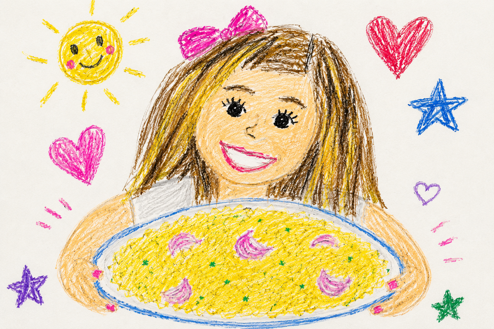
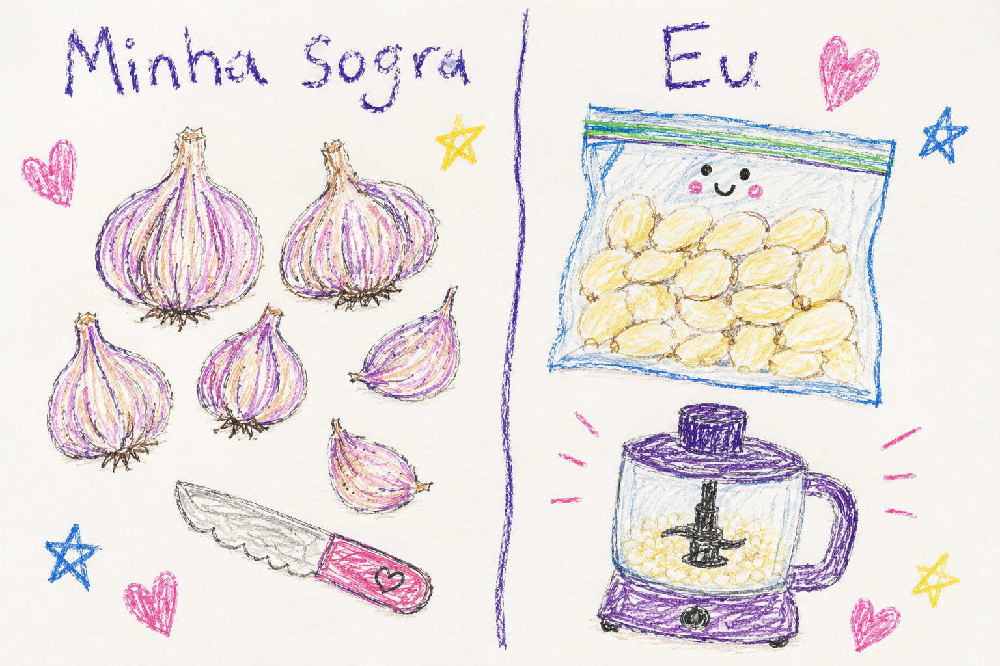

Eu gosto muito de cozinhar. Cozinho praticamente desde os meus 13 anos de idade. De lá para cá, já se passaram quase 20 anos.

Nesse tempo, posso dizer que experimentei de tudo. Já queimei comida, já me queimei, já fiz comida ruim e já joguei comida fora. Diria que comecei a acertar meus pratos com mais consistência somente nos últimos cinco anos.

Isso significa que passei cerca de 75% desse tempo aprendendo e, com certeza, errando muito mais do que acertando. Muito mais do que fazendo as coisas perfeitamente.

E não me entenda mal: isso não significa que, ao longo desses quase 20 anos, eu tenha me preocupado apenas em preparar alguma coisa para me alimentar. Na esmagadora maioria das vezes, eu errei justamente em situações nas quais meu objetivo era entregar um prato digno de restaurante. Esse é o meu hobby.

De acordo com as pessoas mais próximas de mim, especialmente aquelas que já comeram da minha comida mais de uma vez, eu cozinho muito bem (dito por elas!!!. Não usaria um espaço privado como este para me auto-bajular, rs.)

Feita essa breve digressão sobre minha relação com a gastronomia, apresento-lhes a farofa da minha sogra.

Minha sogra gosta de cortar o alho de uma maneira muito específica quando prepara farofa. A farofa dela é muito boa, mas eu sempre desconfiei que conseguiria chegar ao mesmo resultado — ou a um resultado indistinguível ao paladar — em uma fração do tempo.

Acontece que minha sogra gosta de descascar o alho da forma mais difícil possível!

Ela não esmaga o alho, não o aquece e não utiliza nenhum recurso que possa economizar tempo. Vai alho por alho, um a um, retirando cada camada infinitesimalmente fina de pele, como se estivesse lapidando-o.

Em seguida, usando uma faca que nem sequer foi feita propriamente para corte, transforma o alho em lascas muito finas. Depois, coloca essas lâminas em uma frigideira com uma quantidade exorbitante de manteiga, acrescenta a farinha de mandioca, mexe por alguns segundos e pronto.

Corrige o sal e está feita a farofa de alho da minha sogra, que, repito, é muito gostosa.

Certa vez, quando a questionei sobre por que gastava tanto tempo nesse processo, ela disse que o sabor ficava diferente.

Imediatamente, lembrei-me de todos os anos em que cozinhei e tive muita confiança de que aquela não poderia ser a resposta. Estava convícto que, dado o contexto onde a farofa era um acompanhamento, seria impossivel notar diferença caso o alho fosse preparado de outra forma.

Burro que fui, continuei questionando.

Mas, a partir daquele momento, eu já não falava mais apenas com a minha sogra. Falava com uma pessoa que havia sido questionada sobre algo em que provavelmente nunca tinha parado para pensar e que, diante disso, colocou um escudo à sua frente.

Tudo o que eu dissesse dali em diante seria rebatido com respostas que já não tinham muita relação com a pergunta inicial.

Alguns meses depois, pude confirmar minha hipótese.. Minha namorada pediu que eu preparasse o almoço, e ficou sob minha responsabilidade fazer também a farofa.

Fui ao mercado, comprei um saco de alho já descascado. Cortei as partes que estavam ligeiramente mais escuras, coloquei tudo no processador e levei à frigideira com uma quantidade exorbitante de manteiga — porque isso, de fato, não pode faltar.

E voilà: estava pronta a farofa de alho.

Ainda durante o almoço, sem que eu falasse nada, todos elogiaram:

— Nossa, a farofa ficou muito boa.

Foi nesse momento que comecei a refletir.

Aqui, é importante fazer uma observação fundamental: o prato principal não era a farofa. Que dirá a farofa de alho.

Tratava-se de um acompanhamento que seria degustado junto de outros alimentos. Portanto, quando estivesse na boca, seria virtualmente impossível distinguir uma versão da outra, a não ser visualmente (alho em lascas vs alho triturado). Ainda assim, o sabor é indistinguível.

Só que, desde o dia em que conversei com minha sogra sobre isso até o momento em que fiquei responsável por preparar o almoço, ela continuou fazendo o alho da maneira usual (by the way, continua até hoje, rs)

E eu me questionava: por que ela continua investindo tanto tempo nisso, mesmo depois de eu ter pontuado que talvez não fizesse diferença? Mesmo depois de eu ter mostrado uma solução mais rapida, simples e que não alterava o sabor?

Foi então que comecei uma reflexão interna... Será que isso nunca aconteceu comigo? Ou com você, apenas se manifestando de maneiras diferentes?

Acontece que, enquanto minha sogra descascava o alho, ela aproveitava para conversar, fofocar sobre alguma coisa, perguntar às filhas como estava a vida, ouvir o culto, reclamar e, eventualmente, exercitar sua coordenação motora.

Aquele momento não era apenas sobre preparar o almoço.

Eu demorei um pouco para entender isso.

Na minha cabeça, sempre preocupada em fazer as coisas de forma rápida e objetiva, faltou sensibilidade para perceber o que estava acontecendo.

Talvez eu não tenha tido essa sensibilidade justamente porque, muitas vezes, sou eu a pessoa que gasta tempo descascando e cortando o alho da maneira mais demorada e mais difícil, acreditando que isso produzirá um resultado melhor.

A diferença essencial é que, no caso dela, o valor não estava no produto final. Estava no processo. Estava no meio do caminho.

Justamente por não haver uma diferença relevante entre fazer da forma rápida e fazer da forma demorada, por que ela não poderia escolher a forma mais demorada e, ao mesmo tempo, conversar, conviver e aproveitar aquele momento?

Se ela simplesmente colocasse tudo no processador, estaria abdicando disso.

Acho que o ponto é que só conseguimos afirmar que algo não vale o tempo investido depois de já termos gasto tempo suficiente para testar e verificar se realmente não faz diferença.

Acontece que cozinhar é o meu hobby. Por isso, pude me dar ao luxo de levar quase 20 anos para aprender. Para ela, de alguma forma, também.

No trabalho, não necessariamente temos esse luxo.

No trabalho, às vezes precisamos confiar na experiência de quem já faz farofa de alho há mais tempo do que nós e simplesmente aceitar que determinado esforço não fará diferença.

Não naquele momento. Não para o resultado esperado.

Não para o almoço de domingo. Não para o que era necessário agora...

Quando nos recusamos a aceitar isso e insistimos em descobrir tudo sozinhos, acabamos exatamente na mesma posição em que eu acreditava que minha sogra estava.

Uma posição que, para mim, não fazia sentido algum.

A diferença é que minha sogra não tinha nada a perder...

Pelo contrário: ela estava ganhando um momento de descontração. Estava conversando, convivendo e vivendo a vida.

Eu não.

Eu estava apenas sendo teimoso.
